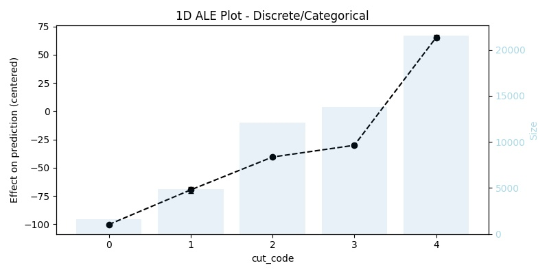
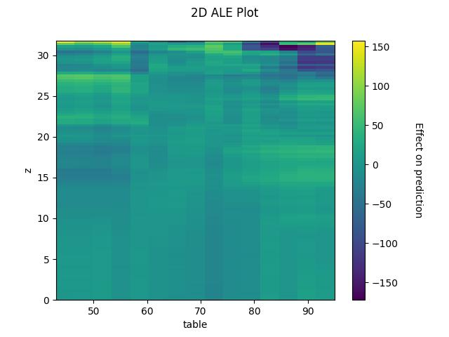
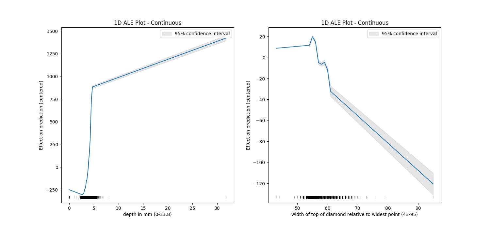

# PyALE

**ALE**: Accumulated Local Effects <br>
A python implementation of the ALE plots based on the implementation of the R package [ALEPlot](https://github.com/cran/ALEPlot/blob/master/R/ALEPlot.R)


## Usage:
* Prepare data and train a model

```python
import pandas as pd
from sklearn.ensemble import RandomForestRegressor

# get the raw diamond data (from R's ggplot2) 
dat_diamonds = pd.read_csv('https://raw.githubusercontent.com/tidyverse/ggplot2/master/data-raw/diamonds.csv')
X = dat_diamonds.loc[:, ~dat_diamonds.columns.str.contains('price')]
y = dat_diamonds.loc[:, 'price']

# convert the three text columns to ordered categoricals
X.loc[:,'cut'] = X.loc[:,'cut'].astype(pd.api.types.CategoricalDtype(
  categories = ['Fair', 'Good', 'Very Good', 'Premium', 'Ideal'],
  ordered=True))
X.loc[:, 'color'] = X.loc[:,'color'].astype(pd.api.types.CategoricalDtype(
  categories = ['D', 'E', 'F', 'G', 'H', 'I', 'J'],
  ordered=True))
X.loc[:, 'clarity'] = X.loc[:, 'clarity'].astype(pd.api.types.CategoricalDtype(
  categories = ['I1', 'SI2', 'SI1', 'VS2', 'VS1', 'VVS2', 'VVS1', 'IF'  ],
  ordered=True))

# use the codes of each categorical as a numeric encoding for the feature
X.loc[:,'cut'] = X.loc[:,'cut'].cat.codes
X.loc[:, 'color'] = X.loc[:, 'color'].cat.codes
X.loc[:, 'clarity'] = X.loc[:, 'clarity'].cat.codes

model = RandomForestRegressor()
model.fit(X, y)
```
### 1D ALE plot for numeric continuous features 

```python
from PyALE import aleplot_1D_continuous, plot_1D_continuous_eff

ale_res = aleplot_1D_continuous(X, model, 'carat', 20)
plot_1D_continuous_eff(ale_res, X)
```


### 1D ALE plot for numeric discrete features

```python
from PyALE import aleplot_1D_discrete, plot_1D_discrete_eff

ale_res = aleplot_1D_discrete(X, model, 'carat', 20)
plot_1D_discrete_eff(ale_res, X)
```



### 2D ALE plot for numeric features
```python
from PyALE import aleplot_2D_continuous, plot_2D_continuous_eff

ale_res = aleplot_2D_continuous(X, model, ['z', 'table'], 100)
plot_2D_continuous_eff(ale_res, contour=False)
```


Or sometimes it is better to take a look at the effect of each feature on its own but side by side

```python
from PyALE import aleplot_1D_continuous, plot_1D_continuous_eff

ale_res_1 = aleplot_1D_continuous(X, model, 'z', 20)
ale_res_2 = aleplot_1D_continuous(X, model, 'table', 20)

fig, (ax1, ax2) = plt.subplots(1, 2, figsize=(12, 8))
fig, ax1 = plot_1D_continuous_eff(ale_res_1, X, fig, ax1)
fig, ax2 = plot_1D_continuous_eff(ale_res_2, X, fig, ax2)
```


### Ref.
* https://cran.r-project.org/web/packages/ALEPlot/vignettes/AccumulatedLocalEffectPlot.pdf
* https://christophm.github.io/interpretable-ml-book/ale.html
